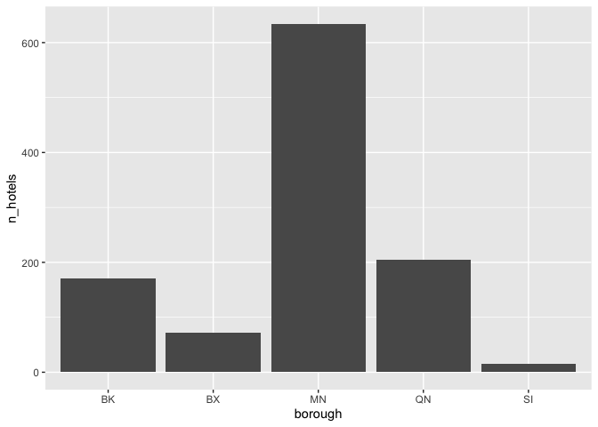

Exploratory Data Analysis
================

``` r
knitr::opts_chunk$set(
    echo = TRUE
)

# install.packages(c("tidyverse", "fs", "zip", "skimr"))
library(tidyverse)
```

    ## ── Attaching packages ────────────────────────────────────────────── tidyverse 1.3.0 ──

    ## ✓ ggplot2 3.3.0     ✓ purrr   0.3.4
    ## ✓ tibble  3.0.1     ✓ dplyr   1.0.0
    ## ✓ tidyr   1.0.2     ✓ stringr 1.4.0
    ## ✓ readr   1.3.1     ✓ forcats 0.5.0

    ## ── Conflicts ───────────────────────────────────────────────── tidyverse_conflicts() ──
    ## x dplyr::filter() masks stats::filter()
    ## x dplyr::lag()    masks stats::lag()

``` r
library(fs)
library(zip)
```

    ## 
    ## Attaching package: 'zip'

    ## The following objects are masked from 'package:utils':
    ## 
    ##     unzip, zip

``` r
library(skimr)
```

``` r
dir_create("data-raw")

zip_file <- path("data-raw", "pluto_20v4.zip")
if (!file_exists(zip_file)) {
  zip_url_base <- "https://www1.nyc.gov/assets/planning/download/zip/data-maps/open-data"
  download.file(
    paste0(zip_url_base, "/nyc_pluto_20v4_csv.zip"),
    path("data-raw", "pluto_20v4.zip"),
    mode = "wb"
  )
}

csv_file <- path("data-raw", "pluto_20v4.csv")
if (!file_exists(csv_file)) {
  unzip(zip_file, exdir = path("data-raw"))
}
```

``` r
pluto_raw <- read_csv(path("data-raw", "pluto_20v4.csv"))
```

    ## Parsed with column specification:
    ## cols(
    ##   .default = col_double(),
    ##   borough = col_character(),
    ##   cb2010 = col_character(),
    ##   schooldist = col_character(),
    ##   firecomp = col_character(),
    ##   sanitdistrict = col_character(),
    ##   sanitsub = col_character(),
    ##   address = col_character(),
    ##   zonedist1 = col_character(),
    ##   zonedist2 = col_character(),
    ##   zonedist3 = col_character(),
    ##   zonedist4 = col_logical(),
    ##   overlay1 = col_character(),
    ##   overlay2 = col_character(),
    ##   spdist1 = col_character(),
    ##   spdist2 = col_character(),
    ##   spdist3 = col_logical(),
    ##   ltdheight = col_logical(),
    ##   splitzone = col_character(),
    ##   bldgclass = col_character(),
    ##   landuse = col_character()
    ##   # ... with 14 more columns
    ## )

    ## See spec(...) for full column specifications.

    ## Warning: 3049 parsing failures.
    ##  row       col           expected actual                      file
    ## 4505 ltdheight 1/0/T/F/TRUE/FALSE   LH-1 'data-raw/pluto_20v4.csv'
    ## 4506 ltdheight 1/0/T/F/TRUE/FALSE   LH-1 'data-raw/pluto_20v4.csv'
    ## 4510 ltdheight 1/0/T/F/TRUE/FALSE   LH-1 'data-raw/pluto_20v4.csv'
    ## 4511 ltdheight 1/0/T/F/TRUE/FALSE   LH-1 'data-raw/pluto_20v4.csv'
    ## 4512 ltdheight 1/0/T/F/TRUE/FALSE   LH-1 'data-raw/pluto_20v4.csv'
    ## .... ......... .................. ...... .........................
    ## See problems(...) for more details.

``` r
problems(pluto_raw) %>% distinct(col, .keep_all = TRUE)
```

    ## # A tibble: 2 x 5
    ##     row col       expected           actual file                     
    ##   <int> <chr>     <chr>              <chr>  <chr>                    
    ## 1  4505 ltdheight 1/0/T/F/TRUE/FALSE LH-1   'data-raw/pluto_20v4.csv'
    ## 2 28875 zonedist4 1/0/T/F/TRUE/FALSE C8-1   'data-raw/pluto_20v4.csv'

``` r
pluto_raw <- read_csv(
  path("data-raw", "pluto_20v4.csv"), 
  col_types = cols(ltdheight = "c", zonedist4 = "c")
)
```

``` r
glimpse(pluto_raw)
```

    ## Rows: 858,986
    ## Columns: 90
    ## $ borough              <chr> "MN", "MN", "BK", "SI", "QN", "QN", "BK", "SI", …
    ## $ block                <dbl> 990, 945, 8152, 1152, 10149, 5865, 7087, 3176, 1…
    ## $ lot                  <dbl> 1, 33, 11, 73, 7501, 150, 5, 14, 7501, 10, 16, 3…
    ## $ cd                   <dbl> 106, 106, 318, 501, 412, 407, 311, 502, 303, 405…
    ## $ ct2010               <dbl> 44.00, 88.00, 1098.00, 239.00, 254.00, 997.04, 4…
    ## $ cb2010               <chr> "5004", "4000", "2006", "1000", "4000", "2000", …
    ## $ schooldist           <chr> "02", "02", "18", "31", "28", "25", "21", "31", …
    ## $ council              <dbl> 4, 4, 42, 49, 28, 19, 47, 50, 36, 30, 19, 11, 30…
    ## $ zipcode              <dbl> 10009, 10016, 11236, 10303, 11433, 11360, 11223,…
    ## $ firecomp             <chr> "L011", "E021", "E257", "L080", "E275", "E306", …
    ## $ policeprct           <dbl> 13, 17, 69, 121, 103, 109, 62, 122, 81, 104, 111…
    ## $ healthcenterdistrict <dbl> 14, 13, 33, 51, 44, 43, 37, 51, 32, 46, 43, 21, …
    ## $ healtharea           <dbl> 6000, 5000, 7520, 200, 3400, 222, 8510, 700, 200…
    ## $ sanitboro            <dbl> 1, 1, 3, 5, 4, 4, 3, 5, 3, 4, 4, 2, 4, 4, 5, 5, …
    ## $ sanitdistrict        <chr> "06", "06", "18", "01", "12", "07", "11", "02", …
    ## $ sanitsub             <chr> "1A", "2B", "1E", "4C", "3C", "8D", "6C", "1D", …
    ## $ address              <chr> "276 AVENUE C", "341 EAST 39 STREET", "FOSTER AV…
    ## $ zonedist1            <chr> "M3-2", "C5-2", "M1-1", "R3-2", "R4", "R5", "M1-…
    ## $ zonedist2            <chr> NA, NA, NA, NA, NA, NA, "R5B", NA, NA, NA, NA, N…
    ## $ zonedist3            <chr> NA, NA, NA, NA, NA, NA, NA, NA, NA, NA, NA, NA, …
    ## $ zonedist4            <chr> NA, NA, NA, NA, NA, NA, NA, NA, NA, NA, NA, NA, …
    ## $ overlay1             <chr> NA, NA, NA, "C1-2", NA, NA, NA, NA, NA, "C2-2", …
    ## $ overlay2             <chr> NA, NA, NA, NA, NA, NA, NA, NA, NA, NA, NA, NA, …
    ## $ spdist1              <chr> NA, NA, NA, NA, NA, NA, NA, NA, NA, NA, NA, "NA-…
    ## $ spdist2              <chr> NA, NA, NA, NA, NA, NA, NA, NA, NA, NA, NA, NA, …
    ## $ spdist3              <lgl> NA, NA, NA, NA, NA, NA, NA, NA, NA, NA, NA, NA, …
    ## $ ltdheight            <chr> NA, NA, NA, NA, NA, NA, NA, NA, NA, NA, NA, NA, …
    ## $ splitzone            <chr> "N", "N", "N", "N", "N", "N", "Y", "N", "N", "N"…
    ## $ bldgclass            <chr> "U2", "U0", "U7", "U6", "R3", "V0", "U1", "U6", …
    ## $ landuse              <chr> "07", "07", "07", "07", "02", "11", "07", "07", …
    ## $ easements            <dbl> 0, 0, 0, 0, 0, 0, 0, 0, 0, 0, 0, 0, 0, 0, 0, 0, …
    ## $ ownertype            <chr> "X", "X", "C", "C", NA, "X", "X", "X", NA, "X", …
    ## $ ownername            <chr> "POWER AUTHORITY OF THE STATE OF NEW YORK", "685…
    ## $ lotarea              <dbl> 370537, 49912, 10877, 394, 40384, 35713, 7949, 5…
    ## $ bldgarea             <dbl> 0, 0, 0, 0, 29117, 0, 0, 0, 6596, 0, 0, 0, 0, 0,…
    ## $ comarea              <dbl> NA, NA, NA, NA, 0, NA, NA, NA, 0, NA, NA, NA, NA…
    ## $ resarea              <dbl> NA, NA, NA, NA, 29117, NA, NA, NA, 6596, NA, NA,…
    ## $ officearea           <dbl> NA, NA, NA, NA, 0, NA, NA, NA, 0, NA, NA, NA, NA…
    ## $ retailarea           <dbl> NA, NA, NA, NA, 0, NA, NA, NA, 0, NA, NA, NA, NA…
    ## $ garagearea           <dbl> NA, NA, NA, NA, 0, NA, NA, NA, 0, NA, NA, NA, NA…
    ## $ strgearea            <dbl> NA, NA, NA, NA, 0, NA, NA, NA, 0, NA, NA, NA, NA…
    ## $ factryarea           <dbl> NA, NA, NA, NA, 0, NA, NA, NA, 0, NA, NA, NA, NA…
    ## $ otherarea            <dbl> NA, NA, NA, NA, 0, NA, NA, NA, 0, NA, NA, NA, NA…
    ## $ areasource           <dbl> 7, 7, 7, 7, 2, 7, 7, 7, 2, 7, 7, 7, 7, 7, 7, 7, …
    ## $ numbldgs             <dbl> 14, 1, 0, 0, 11, 1, 0, 0, 1, 0, 1, 0, 1, 0, 0, 0…
    ## $ numfloors            <dbl> 0, 0, 0, 0, 0, 0, 0, 0, 0, 0, 0, 0, 0, 0, 0, 0, …
    ## $ unitsres             <dbl> 0, 0, 0, 0, 33, 0, 0, 0, 8, 0, 0, 0, 0, 0, 0, 0,…
    ## $ unitstotal           <dbl> 0, 0, 0, 0, 33, 0, 0, 0, 8, 0, 0, 0, 0, 0, 0, 0,…
    ## $ lotfront             <dbl> 244.00, 0.00, 0.00, 10.50, 0.00, 442.00, 0.00, 1…
    ## $ lotdepth             <dbl> 906.00, 0.00, 0.00, 72.75, 0.00, 100.00, 0.00, 1…
    ## $ bldgfront            <dbl> 0, 0, 0, 0, 0, 0, 0, 0, 0, 0, 0, 0, 0, 0, 0, 0, …
    ## $ bldgdepth            <dbl> 0, 0, 0, 0, 0, 0, 0, 0, 0, 0, 0, 0, 0, 0, 0, 0, …
    ## $ ext                  <chr> "N", "N", "N", "N", NA, NA, "N", "N", NA, "N", "…
    ## $ proxcode             <dbl> 0, 0, 0, 0, 0, 0, 0, 0, 0, 0, 0, 0, 0, 0, 0, 0, …
    ## $ irrlotcode           <chr> "Y", "N", "N", "N", "N", "Y", "N", "Y", "N", "Y"…
    ## $ lottype              <dbl> 3, 0, 5, 5, 0, 5, 5, 5, 5, 5, 3, 5, 5, 5, 5, 5, …
    ## $ bsmtcode             <dbl> 0, 0, 0, 0, 5, 5, 0, 0, 5, 0, 0, 5, 0, 0, 0, 5, …
    ## $ assessland           <dbl> 0, 0, 0, 0, 30393, 0, 0, 0, 54708, 0, 0, 12360, …
    ## $ assesstot            <dbl> 0, 0, 0, 0, 489423, 0, 0, 0, 341520, 0, 0, 16680…
    ## $ exempttot            <dbl> 0, 0, 0, 0, 72023, 0, 0, 0, 291592, 0, 0, 0, 0, …
    ## $ yearbuilt            <dbl> 0, 0, 0, 0, 0, 0, 0, 0, 0, 0, 0, 0, 0, 0, 0, 0, …
    ## $ yearalter1           <dbl> 0, 0, 0, 0, 0, 0, 0, 0, 0, 0, 0, 0, 0, 0, 0, 0, …
    ## $ yearalter2           <dbl> 0, 0, 0, 0, 0, 0, 0, 0, 0, 0, 0, 0, 0, 0, 0, 0, …
    ## $ histdist             <chr> NA, NA, NA, NA, NA, NA, NA, NA, NA, NA, NA, NA, …
    ## $ landmark             <chr> NA, NA, NA, NA, NA, NA, NA, NA, NA, NA, NA, NA, …
    ## $ builtfar             <dbl> 0.00, 0.00, 0.00, 0.00, 0.72, 0.00, 0.00, 0.00, …
    ## $ residfar             <dbl> 0.00, 10.00, 0.00, 0.50, 0.75, 1.25, 0.00, 0.50,…
    ## $ commfar              <dbl> 2, 10, 1, 0, 0, 0, 1, 0, 0, 0, 0, 0, 2, 0, 0, 0,…
    ## $ facilfar             <dbl> 0.0, 10.0, 2.4, 1.0, 2.0, 2.0, 2.4, 1.0, 2.0, 2.…
    ## $ borocode             <dbl> 1, 1, 3, 5, 4, 4, 3, 5, 3, 4, 4, 2, 4, 4, 5, 5, …
    ## $ bbl                  <dbl> 1009900001, 1009450033, 3081520011, 5011520073, …
    ## $ condono              <dbl> NA, NA, NA, NA, 379, NA, NA, NA, 3269, NA, NA, N…
    ## $ tract2010            <chr> "0044", "0088", "1098", "0239", "0254", "099704"…
    ## $ xcoord               <dbl> 991643, 991991, 1011957, 943729, 1041806, 104554…
    ## $ ycoord               <dbl> 204932, 211676, 175934, 170589, 192606, 225114, …
    ## $ zonemap              <chr> "12c", "8d", "17d", "20c", "14d", "7d", "28c", "…
    ## $ zmcode               <chr> NA, NA, NA, NA, NA, "Y", NA, NA, NA, NA, NA, NA,…
    ## $ sanborn              <chr> "102 032", "100 000", "317 034", "502 244", "415…
    ## $ taxmap               <dbl> 10310, 10309, 32404, 50503, 44403, 42802, 32105,…
    ## $ edesignum            <lgl> NA, NA, NA, NA, NA, NA, NA, NA, NA, NA, NA, NA, …
    ## $ appbbl               <dbl> NA, 1009450033, NA, NA, 4101490012, NA, NA, NA, …
    ## $ appdate              <chr> NA, "05/12/2005", NA, NA, "06/06/1996", NA, NA, …
    ## $ plutomapid           <dbl> 1, 1, 1, 1, 1, 1, 1, 1, 1, 1, 1, 1, 1, 1, 1, 1, …
    ## $ firm07_flag          <dbl> 1, NA, NA, NA, NA, NA, NA, NA, NA, NA, NA, NA, N…
    ## $ pfirm15_flag         <dbl> 1, NA, NA, NA, NA, NA, NA, NA, NA, NA, NA, NA, N…
    ## $ version              <chr> "20v4", "20v4", "20v4", "20v4", "20v4", "20v4", …
    ## $ dcpedited            <lgl> NA, NA, TRUE, TRUE, NA, NA, NA, NA, NA, NA, NA, …
    ## $ latitude             <dbl> 40.72916, 40.74767, 40.64953, 40.63481, 40.69515…
    ## $ longitude            <dbl> -73.97333, -73.97206, -73.90015, -74.14599, -73.…
    ## $ notes                <dbl> NA, NA, NA, NA, NA, NA, NA, NA, NA, NA, NA, NA, …

``` r
skim(pluto_raw)
```

|                                                  |            |
| :----------------------------------------------- | :--------- |
| Name                                             | pluto\_raw |
| Number of rows                                   | 858986     |
| Number of columns                                | 90         |
| \_\_\_\_\_\_\_\_\_\_\_\_\_\_\_\_\_\_\_\_\_\_\_   |            |
| Column type frequency:                           |            |
| character                                        | 31         |
| logical                                          | 3          |
| numeric                                          | 56         |
| \_\_\_\_\_\_\_\_\_\_\_\_\_\_\_\_\_\_\_\_\_\_\_\_ |            |
| Group variables                                  | None       |

Data summary

**Variable type:
character**

| skim\_variable | n\_missing | complete\_rate | min | max | empty | n\_unique | whitespace |
| :------------- | ---------: | -------------: | --: | --: | ----: | --------: | ---------: |
| borough        |          0 |           1.00 |   2 |   2 |     0 |         5 |          0 |
| cb2010         |       1381 |           1.00 |   4 |   4 |     0 |       368 |          0 |
| schooldist     |       2085 |           1.00 |   2 |   2 |     0 |        32 |          0 |
| firecomp       |       2103 |           1.00 |   4 |   4 |     0 |       348 |          0 |
| sanitdistrict  |       2294 |           1.00 |   2 |   2 |     0 |        29 |          0 |
| sanitsub       |       2424 |           1.00 |   2 |   2 |     0 |        59 |          0 |
| address        |        546 |           1.00 |   4 |  32 |     0 |    828619 |          0 |
| zonedist1      |       2073 |           1.00 |   2 |   9 |     0 |       164 |          0 |
| zonedist2      |     839154 |           0.02 |   2 |   9 |     0 |       147 |          0 |
| zonedist3      |     858775 |           0.00 |   2 |   8 |     0 |        67 |          0 |
| zonedist4      |     858973 |           0.00 |   2 |   5 |     0 |        11 |          0 |
| overlay1       |     784266 |           0.09 |   4 |   4 |     0 |        10 |          0 |
| overlay2       |     858819 |           0.00 |   4 |   4 |     0 |        10 |          0 |
| spdist1        |     757264 |           0.12 |   1 |  10 |     0 |        81 |          0 |
| spdist2        |     858909 |           0.00 |   1 |  10 |     0 |        22 |          0 |
| ltdheight      |     855950 |           0.00 |   4 |   5 |     0 |         2 |          0 |
| splitzone      |       2073 |           1.00 |   1 |   1 |     0 |         2 |          0 |
| bldgclass      |        433 |           1.00 |   2 |   2 |     0 |       213 |          0 |
| landuse        |       2856 |           1.00 |   2 |   2 |     0 |        11 |          0 |
| ownertype      |     822737 |           0.04 |   1 |   1 |     0 |         5 |          0 |
| ownername      |        549 |           1.00 |   1 |  84 |     0 |    733240 |          0 |
| ext            |      58617 |           0.93 |   1 |   2 |     0 |         4 |          0 |
| irrlotcode     |        433 |           1.00 |   1 |   1 |     0 |         2 |          0 |
| histdist       |     828094 |           0.04 |  22 |  66 |     0 |       149 |          0 |
| landmark       |     857546 |           0.00 |  17 |  32 |     0 |         3 |          0 |
| tract2010      |       1381 |           1.00 |   4 |   6 |     0 |      1335 |          0 |
| zonemap        |       2006 |           1.00 |   2 |   3 |     0 |       127 |          0 |
| zmcode         |     843368 |           0.02 |   1 |   1 |     0 |         1 |          0 |
| sanborn        |       2013 |           1.00 |   1 |   8 |     0 |      6449 |          0 |
| appdate        |     766097 |           0.11 |  10 |  10 |     0 |      5336 |          0 |
| version        |          0 |           1.00 |   4 |   4 |     0 |         1 |          0 |

**Variable type: logical**

| skim\_variable | n\_missing | complete\_rate | mean | count      |
| :------------- | ---------: | -------------: | ---: | :--------- |
| spdist3        |     858986 |           0.00 |  NaN | :          |
| edesignum      |     858986 |           0.00 |  NaN | :          |
| dcpedited      |     818422 |           0.05 |    1 | TRU: 40564 |

**Variable type:
numeric**

| skim\_variable       | n\_missing | complete\_rate |          mean |           sd |            p0 |           p25 |           p50 |           p75 |          p100 | hist  |
| :------------------- | ---------: | -------------: | ------------: | -----------: | ------------: | ------------: | ------------: | ------------: | ------------: | :---- |
| block                |          0 |           1.00 |       5308.51 | 3.699740e+03 |   0.00000e+00 |   2.31325e+03 |       4814.00 |       7462.00 |      99999.00 | ▇▁▁▁▁ |
| lot                  |          0 |           1.00 |        136.67 | 7.601900e+02 |   1.00000e+00 |   1.90000e+01 |         39.00 |         64.00 |       9502.00 | ▇▁▁▁▁ |
| cd                   |       1381 |           1.00 |        354.67 | 1.008900e+02 |   1.01000e+02 |   3.06000e+02 |        402.00 |        412.00 |        595.00 | ▁▂▇▇▃ |
| ct2010               |       1381 |           1.00 |        462.37 | 3.776400e+02 |   1.00000e+00 |   1.70000e+02 |        350.00 |        662.00 |       9901.00 | ▇▁▁▁▁ |
| council              |       1382 |           1.00 |         32.11 | 1.325000e+01 |   1.00000e+00 |   2.20000e+01 |         32.00 |         45.00 |         51.00 | ▂▅▆▅▇ |
| zipcode              |       2104 |           1.00 |      11011.57 | 4.714700e+02 |   1.00010e+04 |   1.04660e+04 |      11221.00 |      11370.00 |      12345.00 | ▅▁▇▃▁ |
| policeprct           |       2093 |           1.00 |         87.04 | 2.937000e+01 |   1.00000e+00 |   6.60000e+01 |        102.00 |        111.00 |        123.00 | ▁▂▃▂▇ |
| healthcenterdistrict |       2092 |           1.00 |         38.30 | 9.620000e+00 |   1.10000e+01 |   3.30000e+01 |         41.00 |         45.00 |         51.00 | ▁▂▅▆▇ |
| healtharea           |       2092 |           1.00 |       3261.51 | 2.663810e+03 |   1.00000e+02 |   9.20000e+02 |       2710.00 |       4700.00 |       9300.00 | ▇▆▂▂▃ |
| sanitboro            |       2294 |           1.00 |          3.47 | 1.020000e+00 |   1.00000e+00 |   3.00000e+00 |          4.00 |          4.00 |          5.00 | ▁▂▇▇▃ |
| easements            |        433 |           1.00 |          0.01 | 8.000000e-02 |   0.00000e+00 |   0.00000e+00 |          0.00 |          0.00 |          9.00 | ▇▁▁▁▁ |
| lotarea              |        527 |           1.00 |       8617.86 | 4.963898e+05 |   0.00000e+00 |   2.00000e+03 |       2521.00 |       4000.00 |  214755710.00 | ▇▁▁▁▁ |
| bldgarea             |        442 |           1.00 |       6896.07 | 1.512575e+05 |   0.00000e+00 |   1.38000e+03 |       2000.00 |       3000.00 |   85898156.00 | ▇▁▁▁▁ |
| comarea              |      48101 |           0.94 |       2197.50 | 5.039247e+04 |   0.00000e+00 |   0.00000e+00 |          0.00 |          0.00 |   24000000.00 | ▇▁▁▁▁ |
| resarea              |      48101 |           0.94 |       4264.49 | 3.162412e+04 |   0.00000e+00 |   1.25900e+03 |       1728.00 |       2466.00 |   13211398.00 | ▇▁▁▁▁ |
| officearea           |      48101 |           0.94 |        803.69 | 2.177114e+04 |   0.00000e+00 |   0.00000e+00 |          0.00 |          0.00 |    3583167.00 | ▇▁▁▁▁ |
| retailarea           |      48101 |           0.94 |        340.28 | 5.832930e+03 |   0.00000e+00 |   0.00000e+00 |          0.00 |          0.00 |    2192088.00 | ▇▁▁▁▁ |
| garagearea           |      48101 |           0.94 |        150.15 | 5.837700e+03 |   0.00000e+00 |   0.00000e+00 |          0.00 |          0.00 |    2677430.00 | ▇▁▁▁▁ |
| strgearea            |      48101 |           0.94 |        120.01 | 4.635080e+03 |   0.00000e+00 |   0.00000e+00 |          0.00 |          0.00 |    1757298.00 | ▇▁▁▁▁ |
| factryarea           |      48101 |           0.94 |        124.00 | 4.241260e+03 |   0.00000e+00 |   0.00000e+00 |          0.00 |          0.00 |    1324592.00 | ▇▁▁▁▁ |
| otherarea            |      48101 |           0.94 |        652.96 | 4.182704e+04 |   0.00000e+00 |   0.00000e+00 |          0.00 |          0.00 |   24000000.00 | ▇▁▁▁▁ |
| areasource           |        433 |           1.00 |          2.25 | 1.090000e+00 |   0.00000e+00 |   2.00000e+00 |          2.00 |          2.00 |          7.00 | ▁▇▁▁▁ |
| numbldgs             |        527 |           1.00 |          1.27 | 2.680000e+00 |   0.00000e+00 |   1.00000e+00 |          1.00 |          2.00 |       1831.00 | ▇▁▁▁▁ |
| numfloors            |        527 |           1.00 |          2.34 | 1.990000e+00 |   0.00000e+00 |   2.00000e+00 |          2.00 |          2.50 |        104.00 | ▇▁▁▁▁ |
| unitsres             |        433 |           1.00 |          4.21 | 3.472000e+01 |   0.00000e+00 |   1.00000e+00 |          2.00 |          2.00 |      10914.00 | ▇▁▁▁▁ |
| unitstotal           |        433 |           1.00 |          4.64 | 4.244000e+01 |   0.00000e+00 |   1.00000e+00 |          2.00 |          2.00 |      17369.00 | ▇▁▁▁▁ |
| lotfront             |        527 |           1.00 |         40.08 | 7.512000e+01 |   0.00000e+00 |   2.00000e+01 |         25.00 |         40.00 |       9999.00 | ▇▁▁▁▁ |
| lotdepth             |        527 |           1.00 |        104.05 | 6.888000e+01 |   0.00000e+00 |   9.74200e+01 |        100.00 |        100.00 |       9999.00 | ▇▁▁▁▁ |
| bldgfront            |        527 |           1.00 |         25.80 | 3.376000e+01 |   0.00000e+00 |   1.80000e+01 |         20.00 |         25.00 |       8050.00 | ▇▁▁▁▁ |
| bldgdepth            |        527 |           1.00 |         46.23 | 3.584000e+01 |   0.00000e+00 |   3.40000e+01 |         43.00 |         53.00 |       9388.00 | ▇▁▁▁▁ |
| proxcode             |        433 |           1.00 |          1.53 | 1.030000e+00 |   0.00000e+00 |   1.00000e+00 |          1.00 |          2.00 |          3.00 | ▃▇▁▅▅ |
| lottype              |        433 |           1.00 |          4.71 | 8.500000e-01 |   0.00000e+00 |   5.00000e+00 |          5.00 |          5.00 |          9.00 | ▁▁▇▁▁ |
| bsmtcode             |        433 |           1.00 |          2.11 | 1.370000e+00 |   0.00000e+00 |   1.00000e+00 |          2.00 |          2.00 |          5.00 | ▃▇▁▁▂ |
| assessland           |        433 |           1.00 |     125883.00 | 5.526912e+06 |   0.00000e+00 |   1.02600e+04 |      14220.00 |      22620.00 | 3211276050.00 | ▇▁▁▁▁ |
| assesstot            |        433 |           1.00 |     544970.64 | 1.169461e+07 |   0.00000e+00 |   3.63600e+04 |      52260.00 |      95340.00 | 7240286767.00 | ▇▁▁▁▁ |
| exempttot            |        433 |           1.00 |     184269.06 | 1.074012e+07 |   0.00000e+00 |   0.00000e+00 |          0.00 |       1410.00 | 7240286767.00 | ▇▁▁▁▁ |
| yearbuilt            |        433 |           1.00 |       1845.73 | 4.200400e+02 |   0.00000e+00 |   1.92000e+03 |       1930.00 |       1956.00 |       2020.00 | ▁▁▁▁▇ |
| yearalter1           |        433 |           1.00 |        214.23 | 6.186700e+02 |   0.00000e+00 |   0.00000e+00 |          0.00 |          0.00 |       2020.00 | ▇▁▁▁▁ |
| yearalter2           |        433 |           1.00 |         34.26 | 2.599700e+02 |   0.00000e+00 |   0.00000e+00 |          0.00 |          0.00 |       2020.00 | ▇▁▁▁▁ |
| builtfar             |        843 |           1.00 |          1.10 | 5.500000e+00 |   0.00000e+00 |   4.70000e-01 |          0.73 |          1.23 |       2483.50 | ▇▁▁▁▁ |
| residfar             |        433 |           1.00 |          1.31 | 1.400000e+00 |   0.00000e+00 |   5.00000e-01 |          0.75 |          2.00 |         10.00 | ▇▂▁▁▁ |
| commfar              |        433 |           1.00 |          0.20 | 1.080000e+00 |   0.00000e+00 |   0.00000e+00 |          0.00 |          0.00 |         15.00 | ▇▁▁▁▁ |
| facilfar             |        433 |           1.00 |          2.22 | 1.670000e+00 |   0.00000e+00 |   1.00000e+00 |          2.00 |          2.00 |         15.00 | ▇▁▁▁▁ |
| borocode             |          0 |           1.00 |          3.46 | 1.020000e+00 |   1.00000e+00 |   3.00000e+00 |          4.00 |          4.00 |          5.00 | ▁▂▇▇▃ |
| bbl                  |          0 |           1.00 | 3517545614.07 | 1.031650e+09 |   1.00001e+09 |   3.03171e+09 | 4008650012.50 | 4106580054.75 | 5725380013.00 | ▁▂▇▇▃ |
| condono              |     850436 |           0.01 |       1644.00 | 1.249250e+03 |   1.00000e+00 |   5.68000e+02 |       1409.50 |       2521.00 |       4790.00 | ▇▅▅▂▂ |
| xcoord               |       1479 |           1.00 |    1005936.53 | 3.274045e+04 |   9.13164e+05 |   9.89257e+05 |    1008784.00 |    1029209.00 |    1067279.00 | ▂▂▇▇▃ |
| ycoord               |       1479 |           1.00 |     191292.82 | 3.077330e+04 |   1.20146e+05 |   1.67905e+05 |     189027.00 |     210902.00 |     272730.00 | ▂▆▇▃▂ |
| taxmap               |       2013 |           1.00 |      36717.57 | 1.086081e+04 |   1.00000e+00 |   3.11020e+04 |      40601.00 |      44702.00 |      53203.00 | ▁▁▆▅▇ |
| appbbl               |     766097 |           0.11 | 3745066013.76 | 1.222853e+09 |   1.00002e+09 |   3.02303e+09 | 4049540052.00 | 5022590009.00 | 5080490030.00 | ▂▃▆▆▇ |
| plutomapid           |          0 |           1.00 |          1.00 | 8.000000e-02 |   1.00000e+00 |   1.00000e+00 |          1.00 |          1.00 |          5.00 | ▇▁▁▁▁ |
| firm07\_flag         |     824278 |           0.04 |          1.00 | 0.000000e+00 |   1.00000e+00 |   1.00000e+00 |          1.00 |          1.00 |          1.00 | ▁▁▇▁▁ |
| pfirm15\_flag        |     793239 |           0.08 |          1.00 | 0.000000e+00 |   1.00000e+00 |   1.00000e+00 |          1.00 |          1.00 |          1.00 | ▁▁▇▁▁ |
| latitude             |       1479 |           1.00 |         40.69 | 8.000000e-02 |   4.05000e+01 |   4.06300e+01 |         40.69 |         40.75 |         40.92 | ▂▆▇▃▂ |
| longitude            |       1479 |           1.00 |       \-73.92 | 1.200000e-01 | \-7.42600e+01 | \-7.39800e+01 |       \-73.91 |       \-73.84 |       \-73.70 | ▂▂▇▇▃ |
| notes                |     858424 |           0.00 |          1.00 | 0.000000e+00 |   1.00000e+00 |   1.00000e+00 |          1.00 |          1.00 |          1.00 | ▁▁▇▁▁ |

``` r
pluto_hotels <- pluto_raw %>% 
  # keep only hotel properties
  filter(str_detect(bldgclass, "H")) %>% 
  # keep only necessary columns
  select(
    bbl, 
    borough, 
    bldgclass, 
    starts_with("units"), 
    ends_with("area"), 
    -healtharea,
    latitude, 
    longitude
  )

pluto_hotels
```

    ## # A tibble: 1,096 x 17
    ##       bbl borough bldgclass unitsres unitstotal lotarea bldgarea comarea resarea
    ##     <dbl> <chr>   <chr>        <dbl>      <dbl>   <dbl>    <dbl>   <dbl>   <dbl>
    ##  1 1.00e9 MN      HB               0          2    3234    24238    1600       0
    ##  2 1.00e9 MN      H5               0          1    9530    49197      NA      NA
    ##  3 1.00e9 MN      H3               0          4    3127    31214    2900       0
    ##  4 1.00e9 MN      HB               0          1    9850    48479      NA      NA
    ##  5 1.01e9 MN      HB              75         77   10000    67452   16600       0
    ##  6 1.01e9 MN      HB               8          9    5306    43600    5200       0
    ##  7 1.01e9 MN      H3              10         78    4130    20184      NA      NA
    ##  8 1.01e9 MN      H9               0          2    3360    24027   16800   20160
    ##  9 1.01e9 MN      H8               1          2    6453    28516      NA      NA
    ## 10 1.01e9 MN      H4               0          2    3612    10514    3961       0
    ## # … with 1,086 more rows, and 8 more variables: officearea <dbl>,
    ## #   retailarea <dbl>, garagearea <dbl>, strgearea <dbl>, factryarea <dbl>,
    ## #   otherarea <dbl>, latitude <dbl>, longitude <dbl>

``` r
skim(pluto_hotels)
```

|                                                  |               |
| :----------------------------------------------- | :------------ |
| Name                                             | pluto\_hotels |
| Number of rows                                   | 1096          |
| Number of columns                                | 17            |
| \_\_\_\_\_\_\_\_\_\_\_\_\_\_\_\_\_\_\_\_\_\_\_   |               |
| Column type frequency:                           |               |
| character                                        | 2             |
| numeric                                          | 15            |
| \_\_\_\_\_\_\_\_\_\_\_\_\_\_\_\_\_\_\_\_\_\_\_\_ |               |
| Group variables                                  | None          |

Data summary

**Variable type:
character**

| skim\_variable | n\_missing | complete\_rate | min | max | empty | n\_unique | whitespace |
| :------------- | ---------: | -------------: | --: | --: | ----: | --------: | ---------: |
| borough        |          0 |              1 |   2 |   2 |     0 |         5 |          0 |
| bldgclass      |          0 |              1 |   2 |   2 |     0 |        14 |          0 |

**Variable type:
numeric**

| skim\_variable | n\_missing | complete\_rate |          mean |           sd |            p0 |           p25 |           p50 |           p75 |          p100 | hist  |
| :------------- | ---------: | -------------: | ------------: | -----------: | ------------: | ------------: | ------------: | ------------: | ------------: | :---- |
| bbl            |          0 |           1.00 | 2014707395.72 | 1.284984e+09 |   1.00008e+09 |   1.00840e+09 | 1013755051.50 | 3031312522.50 | 5075840099.00 | ▇▁▂▂▁ |
| unitsres       |          0 |           1.00 |          9.23 | 6.767000e+01 |   0.00000e+00 |   0.00000e+00 |          0.00 |          0.00 |       1904.00 | ▇▁▁▁▁ |
| unitstotal     |          0 |           1.00 |         32.11 | 9.383000e+01 |   0.00000e+00 |   1.00000e+00 |          1.00 |          9.00 |       1921.00 | ▇▁▁▁▁ |
| lotarea        |          0 |           1.00 |      12514.41 | 1.896002e+04 |   5.71000e+02 |   4.93800e+03 |       7569.00 |      13753.75 |     265237.00 | ▇▁▁▁▁ |
| bldgarea       |          0 |           1.00 |      80233.35 | 1.259699e+05 |   1.32500e+03 |   1.98030e+04 |      40672.00 |      91324.00 |    1485916.00 | ▇▁▁▁▁ |
| comarea        |        632 |           0.42 |      13498.44 | 2.821055e+04 |   0.00000e+00 |   2.16075e+03 |       4410.00 |      10102.00 |     277663.00 | ▇▁▁▁▁ |
| resarea        |        632 |           0.42 |       1811.49 | 1.040451e+04 |   0.00000e+00 |   0.00000e+00 |          0.00 |          0.00 |     133018.00 | ▇▁▁▁▁ |
| officearea     |        632 |           0.42 |       2589.05 | 1.263540e+04 |   0.00000e+00 |   0.00000e+00 |          0.00 |          0.00 |     163265.00 | ▇▁▁▁▁ |
| retailarea     |        632 |           0.42 |       5081.05 | 1.192373e+04 |   0.00000e+00 |   0.00000e+00 |       2185.50 |       5000.00 |     159101.00 | ▇▁▁▁▁ |
| garagearea     |        632 |           0.42 |       2930.97 | 1.302448e+04 |   0.00000e+00 |   0.00000e+00 |          0.00 |          0.00 |     121624.00 | ▇▁▁▁▁ |
| strgearea      |        632 |           0.42 |        416.06 | 2.905180e+03 |   0.00000e+00 |   0.00000e+00 |          0.00 |          0.00 |      37425.00 | ▇▁▁▁▁ |
| factryarea     |        632 |           0.42 |        169.94 | 1.872730e+03 |   0.00000e+00 |   0.00000e+00 |          0.00 |          0.00 |      28300.00 | ▇▁▁▁▁ |
| otherarea      |        632 |           0.42 |       1618.75 | 1.022580e+04 |   0.00000e+00 |   0.00000e+00 |          0.00 |          0.00 |     141091.00 | ▇▁▁▁▁ |
| latitude       |          6 |           0.99 |         40.74 | 5.000000e-02 |   4.05200e+01 |   4.07100e+01 |         40.75 |         40.76 |         40.91 | ▁▂▇▇▁ |
| longitude      |          6 |           0.99 |       \-73.95 | 6.000000e-02 | \-7.42400e+01 | \-7.39900e+01 |       \-73.98 |       \-73.94 |       \-73.71 | ▁▁▇▂▁ |

``` r
boro_hotel_stats <- pluto_hotels %>% 
  group_by(borough) %>% 
  summarise(
    n_hotels = n(),
    tot_bldg_area = sum(bldgarea, na.rm = TRUE),
    .groups = "drop"
  )

boro_hotel_stats
```

    ## # A tibble: 5 x 3
    ##   borough n_hotels tot_bldg_area
    ##   <chr>      <int>         <dbl>
    ## 1 BK           170       7095282
    ## 2 BX            72       1741019
    ## 3 MN           634      67773042
    ## 4 QN           204      10632419
    ## 5 SI            16        693994

``` r
ggplot(boro_hotel_stats) +
  aes(x = borough, y = n_hotels) +
  geom_col()
```

<!-- -->
